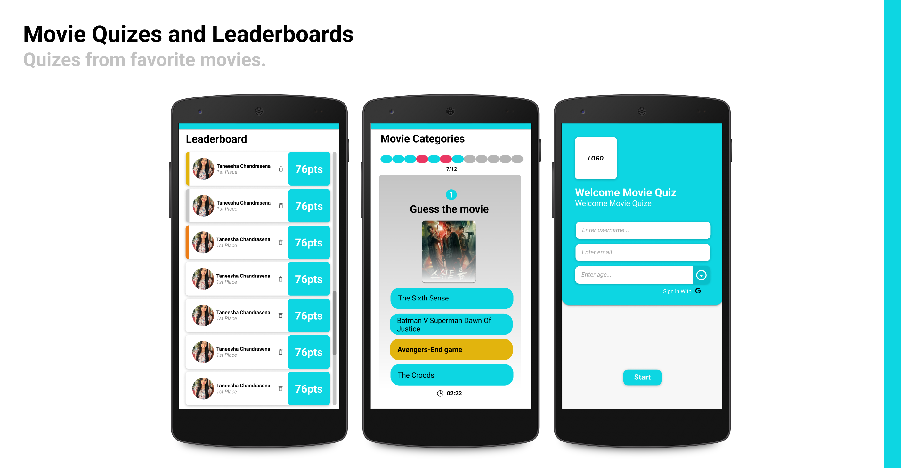

# Movie Quiz Flutter Application - CTSE Assignment - 1

Movie Quiz Application.

## Getting Started

This project is a Movie Quiz Flutter Application. Included functions are, Users can maintain personal library collection with their favorite movies and complete quizes from each movie category. Based on the score they can gain points. User authentication with Firebase authentication and backend implementation done using Firebase Cloud Firestore database.

## Movie Quizes and Leaderboard.

